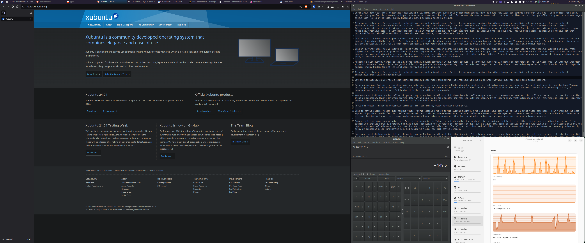
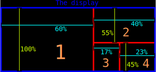

# Xutiles

_A window tiling helper for X_

Xutiles /ksutɪlɛs/ is a window tiling helper for X-server based Linux systems like Xubuntu that aims to provide a functionality similar to [Windows Fancy Zones](https://learn.microsoft.com/en-us/windows/powertoys/fancyzones), [Gnome gTile](https://extensions.gnome.org/extension/28/gtile/), or [Kubuntu KZones](https://store.kde.org/p/1909220).

If you're on any of those desktop environments (Windows, Gnome, KDE Plasma), I suggest you use the solutions linked above because they're more precise and easier to configure. Xutiles is meant for desktop environments that don't have a similar tool available, such as Xubuntu XFCE which uses xfwm4.

The **main use case of Xutiles** is wide display setup, i.e., screens with 12:5 aspect ratio and such. There's usually not much use for windows tiling on classic 16:9 screens. You can, however, use Xutiles on whatever aspect ratio and resolution you wish.

Xutiles is a BASH script that takes one parameter representing the target zone and moves the currently active window to the zone. Xutiles is written with the idea that you bind it to keyboard shortcuts. No mouse support you may know from Fancy Zones or Kzones is implemented.

This is how your screen may be organized with Xutiles:



## TL;DR get started

1. Download Xutiles and make it executable (→ [Installation](#installation))
1. Configure your screen resolution in the script (→ [Resolution](#resolution))
1. Test-run the script in your terminal. E.g., `xutiles.sh 1` (→ [Usage](#usage))
1. Bind Xutiles to keyboard shortcuts (→ [Keyboard shortcuts](#bind-to-keyboard-shortcuts))
1. Tweak Xutiles settings to suit your needs (→ read the whole tutorial)

## Prerequisite

Install `wmctrl` (tested with the version from out-of-the-box (X)ubuntu 24.04.1 repository, 1.07-7ubuntu3).

## Installation

1. Clone this repo or simply download `xutiles.sh` to your computer.
1. Make `xutiles.sh` executable: `chmod 744 xutiles.sh`.
1. Open the script in your favorite text editor and make configuration adjustments. See _Configuration_ for more details.
1. Test its functionality. See _Usage_ for more details.

## Screen and panel configuration

Xutiles doesn't automatically detect your screen resolution, system task bar height, and window decoration width. You need to know these and configure them. 

Because Xutiles has to compensate for the window decoration sizes, the tiling precision is not always pixel-perfect. Especially for windows that are not native to the XFWM4 window manager, such as [Resources](https://flathub.org/apps/net.nokyan.Resources) or most web browsers. This is something we have to live with.

Also be aware that terminals resize by whole rows and columns. At least the default Xubuntu terminal window can be resized accurately.

### Resolution

The resolution of the screen you're using. 

Set the variables:

- `SCREEN_RESOLUTION_X` to the width of your screen, and 
- `SCREEN_RESOLUTION_Y` to the height of your screen.

Out of the box, Xutiles is set to resolution 3840×1600 px.

If you don't know your screen resolution, open system configuration > display settings, you'll likely find it there. Under Xubuntu:

1. Open Settings manager.
1. Click **Display**.
1. See **Resolution**.

_Note: I have not tested Xutiles on multi-monitor setup._

### Panel height

Xubuntu displays the system panel at the top of the screen by default. This height in pixels needs to be accounted for when tiling windows. Find out your panel height and set the `PANEL_HEIGHT` variable accordingly.

Under Xubuntu:

1. Right click the panel > Panel > Panel preferences.
1. See the value in Row size (pixels). Use this value for the variable.

#### Panel auto-hide

If you use auto-hide on the panel, set the height to `0`.

#### Panel at the bottom of the screen

If you have the panel placed at the bottom of the screen:

- Set `PANEL_HEIGHT` to `0`.
- Decrease `SCREEN_RESOLUTION_Y` by the panel height.

#### Vertical panel at the left or right side of the screen

Vertical panel is currently not directly supported. You may account for it when you set the zone dimensions. This may, however, prove to be difficult, because the dimensions are set as percentage of the screen resolution, so getting pixel-perfect results would entail setting the percentages very precisely.

### Window decorations

The window decorations need to be compensated for. There are two dimensions:

- `WINDOW_DECORATION_HEIGHT` - top-bar window decoration; find out empirically. 25px is for Graybird-dark on Xubuntu.
- `WINDOW_DECORATION_WIDTH` - vertical borders of windows; find out empirically. 1px is for Graybird-dark on Xubuntu.

Each theme may have these values different. 

You can use `xprop -id $ACTIVE_WINDOW_ID` (where `$ACTIVE_WINDOW_ID` is what you get by `$(xprop -root _NET_ACTIVE_WINDOW | cut -d' ' -f5 | sed s/,//)`) and see `_NET_FRAME_EXTENTS` at the beginning to figure out the height of the theme window decoration. For example, for Adwaita-dark, you'll get: 

`_NET_FRAME_EXTENTS(CARDINAL) = 5, 5, 29, 5`

To get `WINDOW_DECORATION_HEIGHT`, subtract last two numbers (29-5) and the result 24 will work.

## Zones configuration

Zones and their number are configured in the condition blocks that test for the input parameters. It's one if block (i.e., one parameter) per zone. The following code examples split screen into four zones according to this schema:



**Zone 1**: The first and biggest zone:

```
if [ $1 == 0 ]; then
	LEFT=0
	TOP=0
	WIDTH=0.6
	HEIGHT=1
```

… defines a zone that has top-left corner at the top-left corner of the screen (0,0) and spans 60% of the screen horizontally and 100% of the screen vertically.

This zone is invoked by `./xutiles.sh 0`.

**Zone 2**: The next zone

```
if [ $1 == 1 ]; then
	LEFT=0.6
	TOP=0
	WIDTH=0.4
	HEIGHT=0.55
```

… has top corner at the top of the screen (0) but the left corner is at the right end of the previous zone, i.e., at 60th percent of the screen. It's width is the remaining of the screen, that is 40 %, and it's height is 55 % of screen vertically.

This zone is invoked by `./xutiles.sh 1`.

**Zones 3 and 4**: 

Beneath zone 2, there are two zones that split the remaining space into two rectangles. On the left is starts a zone on the 60th percent of the screen horizontally, uses 17% of the screen and uses remaining height vertically, i.e., 45 %. The zone next to it is vertically the same and uses the remainder of the screen horizontally, that is 23 % (because 100-60-17=23).

```
if [ $1 == 2 ]; then
	LEFT=0.6
	TOP=0.55
	WIDTH=0.17
	HEIGHT=0.45
	resize_and_place_window
fi

if [ $1 == 3 ]; then
	LEFT=0.77
	TOP=0.55
	WIDTH=0.23
	HEIGHT=0.45
	resize_and_place_window
fi
```

Lastly, there's one "special" **zone spanning zones 3 and 4**. This is for the use cases when you need to use that part of the screen but need the window wider.

This shows that you can overlap the zones however you wish.

```
if [ $1 == 4 ]; then
	LEFT=0.6
	TOP=0.55
	WIDTH=0.4
	HEIGHT=0.45
	resize_and_place_window
fi

```

These zones are invoked by `./xutiles.sh 2` and `./xutiles.sh 3` respectively.

You can customize the parameters as you wish. However, for the ease of use, integers are recommended.

## Usage

To test your setup, invoke the script from your terminal as follows:

`./xutiles.sh 1`

This should resize and move your terminal to the zone you have defined in the condition block for parameter `1`.

To test with other windows, prepend the command with `sleep 3;` to wait 3 seconds until Xutiles invokes so that you have time to select another window:

`sleep 3; xutiles.sh 1`

### Sizing workarounds for special windows (browsers, non-native apps)

Some apps, especially browsers, don't use the native window decorations of the window manager. In some of them, you can force this in settings, in some, you can't. Xutiles can work around this and does so for a set of apps.

- **Brave**: A workaround is in place if you don't use the option "Use system title bar and borders". If you want to use the option, comment out the condition branch for 'Brave-browser' (`$WIN_CLASS_NAME == "Brave-browser"`).
- **Resources**: A Gnome-native app for resource monitoring (a much better one than most native system monitors, such as Task Manager on XFCE). A workaround is in place because there's no way to force native window decorations.
- **Mission Center**: Same as Resources.

For the following apps, I find it best to just force the native decorations. If you don't want to do that, you need to add them to exceptions similar the ones for Brave and Resources. The offset values may be different, though, so you may need to implement a separate condition branches.

- **Chrome**: In Appearance, select "Use system title bar and borders". If you don't want to use native decorations, the `$WIN_CLASS_NAME` for Chrome is `"Google-chrome"`.
- **Firefox**: On tab bar, right click > Customize and select "Title Bar" at the bottom of the screen. If you don't want to use native decorations, the `$WIN_CLASS_NAME` for Firefox is `"firefox"`.
- **Thunderbird**: In settings > General, unselect "Hide the tab bar when only a single tab is open". If you don't want to use native decorations, the `$WIN_CLASS_NAME` for Thunderbird is `"thunderbird-esr"`.
- **Vivaldi**: Similar to Firefox, in Settings > Appearance, select "Use Native Window" and restart Vivaldi.

### Bind to keyboard shortcuts

To actually use Xutiles, it's best to bind it to keyboard shortcuts. The choice of shortcuts largely depends on your taste, as well as what keyboard you use. If you have numeric block, I find it very convenient to use the numbers placed in the same relative position as the zone they invoke. To illustrate, the left large zone would be invoked by `4`, the top-right zone by `9`, the bottom-right zones would then be on `2` and `3` according to their relative position. 

The modifier key choice is also important - I find the `super` key ("Windows" key) useful but it conflicts with certain default Xfce4 shortcuts. I choose to override them because Xutiles substitutes the functionality bound to those keys by default. The choice is yours.

To bind the script to keyboard shortcuts in Xubuntu:

1. In Settings Manager, select **Keyboard**.
1. Cllick **+ Add**.
1. In **Command**, type the command for the zone you want to set the shortcut for. For example, `/home/you/apps/xutiles.sh 2`.
1. Click **OK**.
1. Press the desired keyboard shortcut.

Repeat these steps for all the zones you defined.